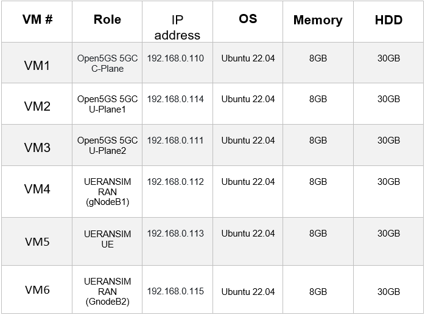
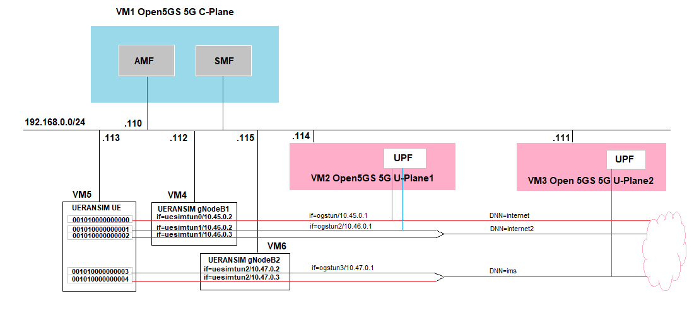

[](https://classroom.github.com/a/qFG2YiDH)
[](https://classroom.github.com/open-in-codespaces?assignment_repo_id=13141671)
# Mobile Computing Project

<!-- PROJECT LOGO -->


<h1 align="center">team_5g_cela_xhelo</h1>
<p align="center">
    <br>
    <br>
    Kejdjon Cela  1439829 
    <br>
    Mariglen Xhelo 1439887
</p>
<br/>

## Feature overview

*   [x] **Comprehensive 5G Simulation Environment** 
*   [x] **Internet Connectivity Integration**
*   [x] **End-to-End Packet Transmission**
*   [x] **Dynamic Network Slicing Capabilities** 
        

## Contents

*   [What is this?](#what-is-this)
*   [Getting started](#getting-started)
    *   [Requirements](#requirements)
    *   [Install](#install)
*   [Overview of Open5GS 5G Core Simulation Mobile Network Setup](#overview-of-open5gs-5g-core-simulation-mobile-network-setup)
*   [Modifications to Configuration Files of Open5GS 5GC and UERANSIM User Equipment UE / Radio Access Network RAN](#modifications-to-configuration-files-of-open5gs-5gc-and-ueransim-user-equipment-ue--radio-access-network-ran)
    * [Useful Commands](#useful-commands)
    * [Adjustments to Configuration Files of Open5GS 5GC Control Plane](#adjustments-to-configuration-files-of-open5gs-5gc-control-plane)
    * [Adjustments to Configuration Files of Open5GS 5GC U-Plane1](#adjustments-to-configuration-files-of-open5gs-5gc-u-plane1)
    * [Adjustments to Configuration Files of Open5GS 5GC U-Plane2](#adjustments-to-configuration-files-of-open5gs-5gc-u-plane2)
    * [Changes in configuration files of UERANSIM RAN](#changes-in-configuration-files-of-ueransim-ran)
    * [Changes in configuration files of UERANSIM UE](#changes-in-configuration-files-of-ueransim-ue)
*   [Network settings of Open5GS 5GC and UERANSIM UE / RAN](network-settings-of-open5gs-5gc-and-ueransim-ue-/-ran)
    * [Network settings of Open5GS U-Plane 1](#network-settings-of-open5gs-u-plane-1)
    * [Network settings of Open5GS U-Plane 2](#network-settings-of-open5gs-u-plane-2) 
*   [Run Open5GS 5GC and UERANSIM UE / RAN](#run-open5gs-5gc-and-ueransim-ue-\-ran)
    * [Run Open5GS 5GC C-Plane](#run-open5gs-5gc-c-plane)
    * [Run Open5GS 5GC U-Plane1](#run-open5gs-5gc-u-plane1)
    * [Run Open5GS 5GC U-Plane2](#run-open5gs-5gc-u-plane2)
    * [Start gNB1](#start-gnb1)
    * [Start UE0](#start-ue0)
    * [Start gNB2](#start-gnb2)
    * [Start UE3](#start-ue3)
*  [Test Ping google.com](#test-ping-googlecom)
*  [Conclusion](#conclusion)
*  [Sources](#sources)


## What is this?

This project focuses on the comprehensive implementation of a 5G core, encompassing crucial components such as Radio Access Networks (RANs), User Equipment (UEs), Data Networks (DNs), and dynamic Network Slicing. The primary objective is to develop a fully functional 5G environment comprising multiple User Equipment’s (UEs), Next Generation Base Stations (gNBs), Network Functions (NFs), and diverse network slices. Through this endeavor, the aim is to create an elaborate simulation platform that accurately mirrors the complexities and functionalities of real-world 5G networks, facilitating in-depth analysis and experimentation within a virtualized environment.

## Getting Started

Before continuing to set up the Open5GS 5G Core Simulation Mobile Network, it's essential to check your machine's parameters to ensure smooth operation.

### Requirements

Our machine parameters were as follows:

- **RAM**: 16 GB DDR4
- **Processor**: Intel i5-10600KF
  - **Total Cores**: 6
  - **Total Threads**: 12
  - **Max Turbo Frequency**: 4.80 GHz
- **Storage**: 1 TB SSD

Please note that running all five VMs with Ubuntu 22.04 installed on each may utilize the full capacity of your machine, potentially leading to system crashes. It's crucial to monitor system resources closely during operation.


### Install

To set up the necessary components for this project, please follow the instructions provided below:

- **Open5GS v2.7.0 (2024-02-12)**: Refer to the [Open5GS Quickstart Guide](https://open5gs.org/open5gs/docs/guide/01-quickstart/) for detailed instructions on setting up Open5GS.

- **UERANSIM v3.2.6**: Follow the installation guidelines outlined in the [UERANSIM Installation Guide](https://github.com/aligungr/UERANSIM/wiki/Installation).

Install MongoDB on the Open5GS 5GC C-Plane machine; MongoDB installation is not required on Open5GS 5GC U-Plane machines.


## Overview of Open5GS 5G Core Simulation Mobile Network Setup

To begin setting up the Open5GS 5G Core Simulation Mobile Network, ensure that VirtualBox is installed on your system. Once installed, create six Virtual Machines (VMs). Each VM should have Ubuntu 22.04 installed.

Below is a table detailing the parameters and IP addresses of each VM:



The constructed simulation environment is outlined as follows: 



## Modifications to Configuration Files of Open5GS 5GC and UERANSIM User Equipment (UE) / Radio Access Network (RAN)

### Useful Commands
Here are some useful commands that can assist you in managing and operating your project:
To modify a YAML file in read-only mode, utilize the command:
```bash
sudo vi amf.yaml
```
YAML files are sensitive to indentation. To edit, press the delete button to remove the existing IP address, then press the insert button to insert your IP. After making necessary changes, save and exit by pressing :wq followed by the Enter key.
To validate a YAML file for errors, execute:
```bash
sudo yamllint amf.yaml
```
After each configuration, restart the corresponding service. For instance, to restart the AMF service, run:
```bash
sudo systemctl restart open5gs-amfd.service
```
To verify the status of a service, execute:
```bash
sudo systemctl status open5gs-amfd
```

Post configuration, ensure that all services are running by executing:
```bash
ps aux | grep open5gs
```

### Adjustments to Configuration Files of Open5GS 5GC Control Plane
For the Control Plane of Open5GS 5GC, three configuration files require adjustments: amf.yaml, smf.yaml, and upf.yaml.

Navigate to the designated directory within your VM1 to access the amf.yaml configuration file. Locate the file at:
```bash
open5gs/install/etc/open5gs/amf.yaml
```
Copy the **amf.yaml** file from this repository's **config_files/Open5GS_C_Plane/amf.yaml** location. Ensure to update the IP addresses within the file to match that of your VM1. Follow the comments provided within the amf.yaml file for guidance on necessary adjustments and configurations.

Navigate to the designated directory within your VM1 to access the smf.yaml configuration file. Locate the file at:
```bash
open5gs/install/etc/open5gs/smf.yaml
```
Copy the **smf.yaml** file from this repository's **config_files/Open5GS_C_Plane/smf.yaml** location. Ensure to update the IP addresses within the file to match that of your VM1. Follow the comments provided within the smf.yaml file for guidance on necessary adjustments and configurations.

Navigate to the designated directory within your VM1 to access the upf.yaml configuration file. Locate the file at:
```bash
open5gs/install/etc/open5gs/upf.yaml
```
Copy the **upf.yaml** file from this repository's **config_files/Open5GS_C_Plane/upf.yaml** location. Ensure to update the IP addresses within the file to match that of your VM1. Follow the comments provided within the upf.yaml file for guidance on necessary adjustments and configurations.

### Adjustments to Configuration Files of Open5GS 5GC U-Plane1
For the U-Plane1 of Open5GS 5GC, one configuration file require adjustments upf.yaml.
Navigate to the designated directory within your VM2 to access the upf.yaml configuration file. Locate the file at:
```bash
open5gs/install/etc/open5gs/upf.yaml
```
Copy the **upf(1).yaml** file from this repository's **config_files/Open5GS_U_Plane(1&2)/upf(1).yaml** location. Ensure to update the IP addresses within the file to match that of your VM2. Follow the comments provided within the upf(1).yaml file for guidance on necessary adjustments and configurations.

### Adjustments to Configuration Files of Open5GS 5GC U-Plane2
For the U-Plane2 of Open5GS 5GC, one configuration file require adjustments upf.yaml.
Navigate to the designated directory within your VM3 to access the upf.yaml configuration file. Locate the file at:
```bash
open5gs/install/etc/open5gs/upf.yaml
```
Copy the **upf(2).yaml** file from this repository's **config_files/Open5GS_U_Plane(1&2)/upf(2).yaml** location. Ensure to update the IP addresses within the file to match that of your VM3. Follow the comments provided within the upf(2).yaml file for guidance on necessary adjustments and configurations.

### Changes in configuration files of UERANSIM RAN
For the UERANSIM RAN, one configuration file require adjustments open5gs-gnb.yaml.
Navigate to the designated directory within your VM4 to access the  open5gs-gnb.yaml configuration file. Locate the file at:
```bash
UERANSIM/config/open5gs-gnb.yaml
```
Copy the **open5gs-gnb.yaml** file from this repository's **config_files/UERANSIM_gNB/open5gs-gnb.yaml** location. Ensure to update the IP addresses within the file to match that of your VM4. Follow the comments provided within the **open5gs-gnb.yaml** file for guidance on necessary adjustments and configurations.

### Changes in configuration files of UERANSIM UE
For the UERANSIM RAN, copy **open5gs-ue0.yaml**, **open5gs-ue1.yaml**, **open5gs-ue2.yaml**, **open5gs-ue3.yaml** and **open5gs-ue4.yaml** files from this repository's **config_files/UERANSIM_UEs** location and past them to the designated directory within your VM5. Add the files at:
```bash
UERANSIM/config
```
Ensure to update the IP address of the gNB to match the IP address of your VM4 gNB. Follow the comments provided within the files for guidance on necessary adjustments and configurations. 
## Network settings of Open5GS 5GC and UERANSIM UE / RAN
### Network settings of Open5GS U-Plane 1
It is necessary to uncomment the next line in the  **/etc/sysctl.conf** file and show it in the OS.
```bash
net.ipv4.ip_forward1
#sysctl -p
```
The following commands are essential every time when initiating U-Plane 1. After that, configure the TUNnel interface and NAPT.
```bash
sudo ip tuntap add name ogstun mode tun
sudo ip addr add 10.45.0.1/16 dev ogstun
sudo ip link set ogstun up

sudo iptables -t nat -A POSTROUTING -s 10.45.0.0/16 ! -o ogstun -j MASQUERADE

sudo ip tuntap add name ogstun2 mode tun
sudo ip addr add 10.46.0.1/16 dev ogstun2
sudo ip link set ogstun2 up

sudo iptables -t nat -A POSTROUTING -s 10.46.0.0/16 ! -o ogstun2 -j MASQUERADE
```
### Network settings of Open5GS U-Plane 2
Like above, first, uncomment the next line in the **/etc/sysctl.conf** file and represent it in the OS.
```bash
net.ipv4.ip_forward1
#sysctl -p
```
The following commands are essential every time when initiating U-Plane 2. Next, the configuration of the TUNnel interface and NAPT is required. Follow the commands below for necessary adjusments.
```bash
sudo ip tuntap add name ogstun3 mode tun
sudo ip addr add 10.47.0.1/16 dev ogstun3
sudo ip link set ogstun3 up

sudo iptables -t nat -A POSTROUTING -s 10.47.0.0/16 ! -o ogstun3 -j MASQUERADE
```
## Run Open5GS 5GC and UERANSIM UE / RAN
### Run Open5GS 5GC C-Plane
When initializing C-Plane for the first time, it is imperative to execute the following commands.
```bash
sudo systemctl start  open5gs-mmed.service open5gs-sgwcd.service open5gs-smfd.service open5gs-amfd.service open5gs-sgwud.service open5gs-upfd.service open5gs-hssd.service open5gs-pcrfd.service open5gs-nrfd.service open5gs-scpd.service open5gs-ausfd.service open5gs-udmd.service open5gs-pcfd.service open5gs-nssfd.service open5gs-bsfd.service open5gs-udrd.service
```
To confirm that all processes are running, we employ the subsequent command.
```bash
ps aux | grep open5gs
```
### Run Open5GS 5GC U-Plane1
Each time U-Plane 1 is launched, review network settings of Open5GS U-Plane 1 section for the required commands.
This command allows to check the current status.
```bash
sudo systemctl status open5gs-upfd.service
```
### Run Open5GS 5GC U-Plane2
Each time U-Plane 2 is launched, review network settings of Open5GS U-Plane 2 section for the required commands.
This command allows to check the current status.
```bash
sudo systemctl status open5gs-upfd.service
```
### Start gNB1
Go to the Home/Ueransim/build directory, open the terminal in this location, and execute the provided command.
```bash
sudo ./nr-gnb -c ../config/open5gs-gnb.yaml
```
Following the execution of the command, the provided information is as follows.
```bash
UERANSIM v3.2.6
[2024-02-18 15:42:08.517] [sctp] [info] Trying to establish SCTP connection... (192.168.0.110:38412)
[2024-02-18 15:42:08.625] [sctp] [info] SCTP connection established (192.168.0.110:38412)
[2024-02-18 15:42:08.625] [sctp] [debug] SCTP association setup ascId[3]
[2024-02-18 15:42:08.625] [ngap] [debug] Sending NG Setup Request
[2024-02-18 15:42:08.658] [ngap] [debug] NG Setup Response received
[2024-02-18 15:42:08.658] [ngap] [info] NG Setup procedure is successful
```
Navigate to the **/var/log/open5gs** directory, open the terminal, and use the following command to view the log.
```bash
sudo cat amf.log
```
Upon execution, the Open5GS C-Plane log is as follows.
```bash
02/18 15:42:08.635: [amf] INFO: gNB-N2 accepted[192.168.0.112]:50113 in ng-path module (../src/amf/ngap-sctp.c:113)
02/18 15:42:08.635: [amf] INFO: gNB-N2 accepted[192.168.0.112] in master_sm module (../src/amf/amf-sm.c:741)
02/18 15:42:08.641: [amf] INFO: [Added] Number of gNBs is now 1 (../src/amf/context.c:1231)
02/18 15:42:08.641: [amf] INFO: gNB-N2[192.168.0.112] max_num_of_ostreams : 10 (../src/amf/amf-sm.c:780)
```
### Start UE0
Go to the Home/Ueransim/build directory, open the terminal in this location, and execute the provided command.
This sequence will register the User Equipment (UE) with the 5G Core (5GC) and establish a PDU session.
```bash
sudo ./nr-gnb -c ../config/open5gs-ue0.yaml
```
Following the execution of the command, the provided information is as follows.
```bash
UERANSIM v3.2.6
[2024-02-18 16:13:15.544] [nas] [info] UE switches to state [MM-DEREGISTERED/PLMN-SEARCH]
[2024-02-18 16:13:15.545] [rrc] [debug] New signal detected for cell[1], total [1] cells in coverage
[2024-02-18 16:13:15.545] [nas] [info] Selected plmn[001/01]
[2024-02-18 16:13:15.545] [rrc] [info] Selected cell plmn[001/01] tac[1] category[SUITABLE]
[2024-02-18 16:13:15.545] [nas] [info] UE switches to state [MM-DEREGISTERED/PS]
[2024-02-18 16:13:15.545] [nas] [info] UE switches to state [MM-DEREGISTERED/NORMAL-SERVICE]
[2024-02-18 16:13:15.545] [nas] [debug] Initial registration required due to [MM-DEREG-NORMAL-SERVICE]
[2024-02-18 16:13:15.545] [nas] [debug] UAC access attempt is allowed for identity[0], category[MO_sig]
[2024-02-18 16:13:15.545] [nas] [debug] Sending Initial Registration
[2024-02-18 16:13:15.547] [nas] [info] UE switches to state [MM-REGISTER-INITIATED]
[2024-02-18 16:13:15.547] [rrc] [debug] Sending RRC Setup Request
[2024-02-18 16:13:15.547] [rrc] [info] RRC connection established
[2024-02-18 16:13:15.547] [rrc] [info] UE switches to state [RRC-CONNECTED]
[2024-02-18 16:13:15.547] [nas] [info] UE switches to state [CM-CONNECTED]
[2024-02-18 16:13:15.797] [nas] [debug] Authentication Request received
[2024-02-18 16:13:15.798] [nas] [debug] Received SQN [000000000101]
[2024-02-18 16:13:15.798] [nas] [debug] SQN-MS [000000000000]
[2024-02-18 16:13:15.818] [nas] [debug] Security Mode Command received
[2024-02-18 16:13:15.818] [nas] [debug] Selected integrity[2] ciphering[0]
[2024-02-18 16:13:16.018] [nas] [debug] Registration accept received
[2024-02-18 16:13:16.018] [nas] [info] UE switches to state [MM-REGISTERED/NORMAL-SERVICE]
[2024-02-18 16:13:16.018] [nas] [debug] Sending Registration Complete
[2024-02-18 16:13:16.018] [nas] [info] Initial Registration is successful
[2024-02-18 16:13:16.018] [nas] [debug] Sending PDU Session Establishment Request
[2024-02-18 16:13:16.018] [nas] [debug] UAC access attempt is allowed for identity[0], category[MO_sig]
[2024-02-18 16:13:16.223] [nas] [debug] Configuration Update Command received
[2024-02-18 16:13:16.367] [nas] [debug] PDU Session Establishment Accept received
[2024-02-18 16:13:16.367] [nas] [info] PDU Session establishment is successful PSI[1]
[2024-02-18 16:13:16.402] [app] [info] Connection setup for PDU session[1] is successful, TUN interface[uesimtun0, 10.45.0.2] is up.
```
Navigate to the **/var/log/open5gs** directory, open the terminal, and use the following command to view the log.
```bash
sudo cat amf.log
```
Upon execution, the Open5GS C-Plane log is as follows.
```bash
02/18 15:42:08.635: [amf] INFO: gNB-N2 accepted[192.168.0.112]:50113 in ng-path module (../src/amf/ngap-sctp.c:113)
02/18 15:42:08.635: [amf] INFO: gNB-N2 accepted[192.168.0.112] in master_sm module (../src/amf/amf-sm.c:741)
02/18 15:42:08.641: [amf] INFO: [Added] Number of gNBs is now 1 (../src/amf/context.c:1231)
02/18 15:42:08.641: [amf] INFO: gNB-N2[192.168.0.112] max_num_of_ostreams : 10 (../src/amf/amf-sm.c:780)
02/18 16:13:15.550: [amf] INFO: InitialUEMessage (../src/amf/ngap-handler.c:401)
02/18 16:13:15.550: [amf] INFO: [Added] Number of gNB-UEs is now 1 (../src/amf/context.c:2550)
02/18 16:13:15.550: [amf] INFO:     RAN_UE_NGAP_ID[1] AMF_UE_NGAP_ID[1] TAC[1] CellID[0x10] (../src/amf/ngap-handler.c:562)
02/18 16:13:15.550: [amf] INFO: [suci-0-001-01-0000-0-0-0000000000] Unknown UE by SUCI (../src/amf/context.c:1835)
02/18 16:13:15.550: [amf] INFO: [Added] Number of AMF-UEs is now 1 (../src/amf/context.c:1616)
02/18 16:13:15.550: [gmm] INFO: Registration request (../src/amf/gmm-sm.c:1165)
02/18 16:13:15.550: [gmm] INFO: [suci-0-001-01-0000-0-0-0000000000]    SUCI (../src/amf/gmm-handler.c:166)
02/18 16:13:15.799: [sbi] INFO: [AUSF] (SCP-discover) NF registered [c79ff862-ce6a-41ee-bfd6-b5504f67a838:1] (../lib/sbi/path.c:211)
02/18 16:13:15.823: [sbi] INFO: [UDM] (SCP-discover) NF registered [c7bccdca-ce6a-41ee-84ed-7f3f85e33318:1] (../lib/sbi/path.c:211)
02/18 16:13:15.848: [sbi] WARNING: [UDM] (SCP-discover) NF has already been added [c7bccdca-ce6a-41ee-84ed-7f3f85e33318:2] (../lib/sbi/path.c:216)
02/18 16:13:16.224: [gmm] INFO: [imsi-001010000000000] Registration complete (../src/amf/gmm-sm.c:2146)
02/18 16:13:16.225: [amf] INFO: [imsi-001010000000000] Configuration update command (../src/amf/nas-path.c:612)
02/18 16:13:16.225: [gmm] INFO:     UTC [2024-02-18T15:13:16] Timezone[0]/DST[0] (../src/amf/gmm-build.c:559)
02/18 16:13:16.225: [gmm] INFO:     LOCAL [2024-02-18T16:13:16] Timezone[3600]/DST[0] (../src/amf/gmm-build.c:564)
02/18 16:13:16.225: [amf] INFO: [Added] Number of AMF-Sessions is now 1 (../src/amf/context.c:2571)
02/18 16:13:16.225: [gmm] INFO: UE SUPI[imsi-001010000000000] DNN[internet] S_NSSAI[SST:1 SD:0xffffff] smContextRef [NULL] (../src/amf/gmm-handler.c:1241)
02/18 16:13:16.225: [gmm] INFO: SMF Instance [cc4a5060-ce6a-41ee-a1be-db9aa3d4a9fe] (../src/amf/gmm-handler.c:1280)
02/18 16:13:16.380: [amf] INFO: [imsi-001010000000000:1:11][0:0:NULL] /nsmf-pdusession/v1/sm-contexts/{smContextRef}/modify (../src/amf/nsmf-handler.c:837)
```
Navigate to the **/var/log/open5gs** directory, open the terminal, and use the following command to view the log.
```bash
sudo cat smf.log
```
Upon execution, the Open5GS C-Plane log is as follows.
```bash
02/18 15:39:05.382: [smf] WARNING: Retry association with peer [192.168.0.114]:8805 failed (../src/smf/pfcp-sm.c:110)
02/18 15:39:05.383: [smf] INFO: PFCP associated [192.168.0.114]:8805 (../src/smf/pfcp-sm.c:196)
02/18 16:13:16.293: [smf] INFO: [Added] Number of SMF-UEs is now 1 (../src/smf/context.c:1019)
02/18 16:13:16.293: [smf] INFO: [Added] Number of SMF-Sessions is now 1 (../src/smf/context.c:3068)
02/18 16:13:16.345: [sbi] INFO: [UDM] (SCP-discover) NF registered [c7bccdca-ce6a-41ee-84ed-7f3f85e33318:1] (../lib/sbi/path.c:211)
02/18 16:13:16.365: [smf] INFO: UE SUPI[imsi-001010000000000] DNN[internet] IPv4[10.45.0.2] IPv6[] (../src/smf/npcf-handler.c:539)
02/18 16:13:16.366: [gtp] INFO: gtp_connect() [192.168.0.114]:2152 (../lib/gtp/path.c:60)
02/18 16:13:16.372: [sbi] WARNING: [UDM] (SCP-discover) NF has already been added [c7bccdca-ce6a-41ee-84ed-7f3f85e33318:2] (../lib/sbi/path.c:216)
```
Navigate to the **/var/log/open5gs** directory, open the terminal, and use the following command to view the log.
```bash
sudo cat upf.log
```
Upon execution, the Open5GS U-Plane1 log is as follows.
```bash
02/18 15:39:05.192: [app] INFO: UPF initialize...done (../src/upf/app.c:31)
02/18 15:39:05.380: [pfcp] INFO: ogs_pfcp_connect() [192.168.0.110]:8805 (../lib/pfcp/path.c:61)
02/18 15:39:05.380: [upf] INFO: PFCP associated [192.168.0.110]:8805 (../src/upf/pfcp-sm.c:184)
02/18 16:13:16.365: [upf] INFO: [Added] Number of UPF-Sessions is now 1 (../src/upf/context.c:208)
02/18 16:13:16.365: [gtp] INFO: gtp_connect() [192.168.0.110]:2152 (../lib/gtp/path.c:60)
02/18 16:13:16.365: [upf] INFO: UE F-SEID[UP:0x51d CP:0x578] APN[internet] PDN-Type[1] IPv4[10.45.0.2] IPv6[] (../src/upf/context.c:485)
02/18 16:13:16.365: [upf] INFO: UE F-SEID[UP:0x51d CP:0x578] APN[internet] PDN-Type[1] IPv4[10.45.0.2] IPv6[] (../src/upf/context.c:485)
02/18 16:13:16.369: [gtp] INFO: gtp_connect() [192.168.0.112]:2152 (../lib/gtp/path.c:60)
```
### Start gNB2
To initiate gNB2, the same procedures as those for gNB1 must be followed.
Go to the Home/Ueransim/build directory, open the terminal in this location, and execute the provided command.
```bash
sudo ./nr-gnb -c ../config/open5gs-gnb.yaml
```
```bash
Following the execution of the command, the provided information is as follows.
UERANSIM v3.2.6
[2024-02-23 15:36:49.385] [sctp] [info] Trying to establish SCTP connection... (192.168.0.110:38412)
[2024-02-23 15:36:49.543] [sctp] [info] SCTP connection established (192.168.0.110:38412)
[2024-02-23 15:36:49.544] [sctp] [debug] SCTP association setup ascId[3]
[2024-02-23 15:36:49.544] [ngap] [debug] Sending NG Setup Request
[2024-02-23 15:36:49.593] [ngap] [debug] NG Setup Response received
[2024-02-23 15:36:49.593] [ngap] [info] NG Setup procedure is successful
```
Navigate to the **/var/log/open5gs** directory, open the terminal, and use the following command to view the log.
```bash
sudo cat amf.log
```
Upon execution, the Open5GS C-Plane log is as follows.
```bash
02/22 13:42:05.631: [amf] INFO: gNB-N2 accepted [192.168.0.115]:47970 in ng-path module (../src/amf/ngap-sctp.c:113) 
02/22 13:42:05.631: [amf] INFO: gNB-N2 accepted [192.168.0.115] in master_sm module (../src/amf/amf-sm.c:741) 
02/22 13:42:05.634: [amf] INFO: [Added] Number of gNBs is now 1 (../src/amf/context.c:1231)
02/22 13:42:05.634: [amf] INFO: gNB-N2[192.168.0.115] max_num_of_ostreams: 10 (../src/amf/amf-sm.c:780) 
```
### Start UE3
Go to the Home/Ueransim/build directory, open the terminal in this location, and execute the provided command.
This sequence will register the User Equipment (UE) with the 5G Core (5GC) and establish a PDU session.
```bash
sudo ./nr-gnb -c ../config/open5gs-ue0.yaml
```
Following the execution of the command, the provided information is as follows.
```bash
[2024-02-22 15:20:44.622] [nas] [info] UE switches to state [MM-DEREGISTERED/PLMN-SEARCH]
[2024-02-22 15:20:44.622] [rrc] [debug] New signal detected for cell[1], total [1] cells in coverage
[2024-02-22 15:20:44.622] [nas] [info] Selected plmn [001/01]
[2024-02-22 15:20:44.622] [rrc] [info] Selected cell plmn[001/01] tac[1] category[SUITABLE]
[2024-02-22 15:20:44.622] [nas] [info] UE switches to state [MM-DEREGISTERED/PS]
[2024-02-22 15:20:44.622] [nas] [info] UE switches to state [MM-DEREGISTERED/NORMAL-SERVICE]
[2024-02-22 15:20:44.622] [nas] [debug] Initial registration required due to [MM-DEREG-NORMAL-SERVICE]
[2024-02-22 15:20:44.622] [nas] [debug] UAC access attempt is allowed for identity[0], category[MO_sig]
[2024-02-22 15:20:44.622] [nas] [debug] Sending Initial Registration
[2024-02-22 15:20:44.623] [nas] [info] UE switches to state [MM-REGISTER-INITIATED]
[2024-02-22 15:20:44.623] [rrc] [debug] Sending RRC Setup Request
[2024-02-22 15:20:44.623] [rrc] [info] RRC connection established
[2024-02-22 15:20:44.623] [rrc] [info] UE switches to state [RRC -CONNECTED]
[2024-02-22 15:20:44.623] [nas] [info] UE switches to state [CM-CONNECTED]
[2024-02-22 15:20:44.628] [nas] [debug] Authentication Request received
[2024-02-22 15:20:44.628] [nas] [debug] Received SQN [000000000081]
[2024-02-22 15:20:44.628] [nas] [debug] SQN-MS [000000000000]
[2024-02-22 15:20:44.631] [nas] [debug] Security Mode Command received
[2024-02-22 15:20:44.631] [nas] [debug] Selected integrity[2] ciphering[0]
[2024-02-22 15:20:44.643] [nas] [debug] Registration accept received
[2024-02-22 15:20:44.643] [nas] [info] UE switches to state [MM-REGISTERED/NORMAL-SERVICE]
[2024-02-22 15:20:44.643] [nas] [debug] Sending Registration Complete
[2024-02-22 15:20:44.643] [nas] [info] Initial Registration is successful
[2024-02-22 15:20:44.643] [nas] [debug] Sending PDU Session Establishment Request
[2024-02-22 15:20:44.643] [nas] [debug] UAC access attempt is allowed for identity[0], category[MO_sig]
[2024-02-22 15:20:44.846] [nas] [debug] Configuration Update Command received
[2024-02-22 15:20:44.886] [nas] [debug] PDU Session Establishment Accept received
[2024-02-22 15:20:44.886] [nas] [info] PDU Session establishment is successful PSI[1]
[2024-02-22 15:20:44.924] [app] [info] Connection setup for PDU session[1] is successful, TUN interface[uesimtuno, 10.47.0.2] is up.
```
## Test Ping google.com
To verify that everything is functioning properly, a comprehensive test will be conducted. In VM5 we use the command below to ping google.com.
```bash
ping -I uesimtun0 google.com
```
The information provided from the ping google.com command is as follows.
```bash
PING google.com (172.217.18.110) from 10.45.0.2 uesimtun0: 56(84) bytes of data.
64 bytes from google.com (172.217.18.110): icmp_seq=1 ttl=114 time=3.24 ms
64 bytes from google.com (172.217.18.110): icmp_seq=2 ttl=114 time=3.87 ms
64 bytes from google.com (172.217.18.110): icmp_seq=3 ttl=114 time=2.92 ms
64 bytes from google.com (172.217.18.110): icmp_seq=4 ttl=114 time=2.54 ms
64 bytes from google.com (172.217.18.110): icmp_seq=5 ttl=114 time=3.23 ms
64 bytes from google.com (172.217.18.110): icmp_seq=6 ttl=114 time=2.92 ms
64 bytes from google.com (172.217.18.110): icmp_seq=7 ttl=114 time=3.12 ms
64 bytes from google.com (172.217.18.110): icmp_seq=8 ttl=114 time=2.97 ms
64 bytes from google.com (172.217.18.110): icmp_seq=9 ttl=114 time=3.08 ms
64 bytes from google.com (172.217.18.110): icmp_seq=10 ttl=114 time=2.90 ms
64 bytes from google.com (172.217.18.110): icmp_seq=11 ttl=114 time=3.06 ms
64 bytes from google.com (172.217.18.110): icmp_seq=12 ttl=114 time=2.82 ms
64 bytes from google.com (172.217.18.110): icmp_seq=13 ttl=114 time=2.70 ms
64 bytes from google.com (172.217.18.110): icmp_seq=14 ttl=114 time=3.50 ms
64 bytes from google.com (172.217.18.110): icmp_seq=15 ttl=114 time=3.39 ms
64 bytes from google.com (172.217.18.110): icmp_seq=16 ttl=114 time=5.67 ms
64 bytes from google.com (172.217.18.110): icmp_seq=17 ttl=114 time=2.43 ms
64 bytes from google.com (172.217.18.110): icmp_seq=18 ttl=114 time=5.71 ms
^C
--- google.com ping statistics ---
18 packets transmitted, 18 received, 0% packet loss, time 17025ms
rtt min/avg/max/mdev = 2.434/3.338/5.705/0.893 ms
```
## Conclusion
In conclusion, the project has successfully achieved its objective of establishing a comprehensive and functional virtualized 5G core simulation environment utilizing Open5GS and UERANSIM. This environment closely resembles real-world 5G networks, enabling in-depth analysis, experimentation, and testing of various scenarios and configurations. The process of configuring multiple virtual machines with Ubuntu 22.04 and installing Open5GS and UERANSIM was precisly executed, ensuring the continuous operation of the simulation environment. The project's success was evident in the successful simulation of both the 5G core and user equipment. By adjusting network settings, running essential services, and executing necessary commands, the simulation environment was set up to simulate the functionalities and interactions of a 5G network. This involved the establishment of the 5G core network, registration of user equipment, and the initiation of data sessions, among other essential operations. The establishment of this simulation environment is a significant milestone in the field of 5G networking. It provides a valuable platform for researchers, developers, and network engineers to conduct experiments, evaluate new technologies, and develop innovative solutions in a controlled and efficient manner. The detailed documentation and step-by-step guide provided in this project also serve as a valuable resource for those looking to replicate or extend this work.

## Sources

1. [My First 5G Core: Open5GS and UERANSIM](https://nickvsnetworking.com/my-first-5g-core-open5gs-and-ueransim/)
2. [5G Core Network Setup with Open5GS and UERANSIM](https://medium.com/rahasak/5g-core-network-setup-with-open5gs-and-ueransim-cd0e77025fd7)
3. [Setting Up Open5GS: A Step-by-Step Guide](https://medium.com/networkers-fiit-stu/setting-up-open5gs-a-step-by-step-guide-or-how-we-set-up-our-lab-environment-5da1c8db0439)
4. [YouTube Video: Open5GS Installation Guide](https://www.youtube.com/watch?v=DxhS2wdbMtc)
5. [5G: An Introduction to the 5th Generation Mobile Networks](https://www.amazon.de/-/en/Ulrich-Trick/dp/3110724375)
6. [Mermaid](https://mermaid.js.org/)
7. [Open5GS VoLTE Setup Tutorial](https://open5gs.org/open5gs/docs/tutorial/02-VoLTE-setup/)


